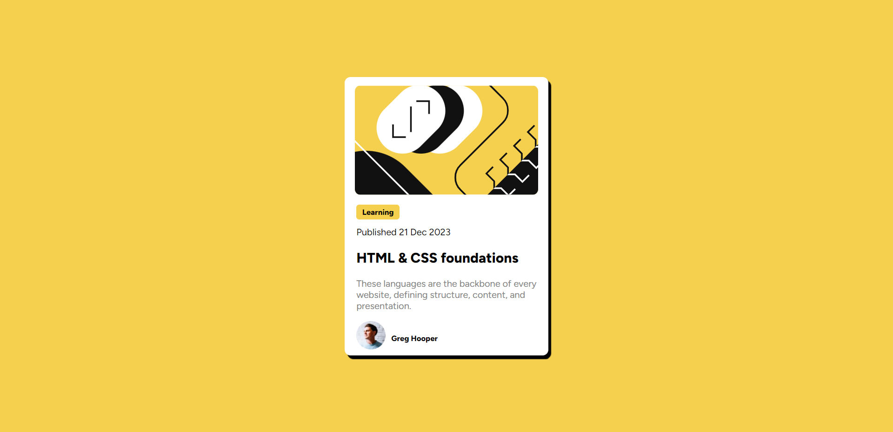

# Frontend Mentor - Blog preview card solution

This is a solution to the [Blog preview card challenge on Frontend Mentor](https://www.frontendmentor.io/challenges/blog-preview-card-ckPaj01IcS). Frontend Mentor challenges help you improve your coding skills by building realistic projects. 

## Table of contents

- [Overview](#overview)
  - [The challenge](#the-challenge)
  - [Screenshot](#screenshot)
  - [Links](#links)
- [My process](#my-process)
  - [Built with](#built-with)
  - [What I learned](#what-i-learned)
- [Author](#author)

**Note: Delete this note and update the table of contents based on what sections you keep.**

## Overview

### The challenge

Users should be able to:

- See hover and focus states for all interactive elements on the page

### Screenshot

### Links

- Solution URL: [https://www.frontendmentor.io/solutions/blog-preview-card-using-css-FDJNVp6Oyf]
- Live Site URL: [https://esthernyumu.github.io/Frontend-Mentor---Blog-preview-card/]

## My process

I wrote the HTML code first putting some sections into divs for easier styling then I proceeded to style with CSS.

### Built with

- HTML5
- CSS 

### What I learned

This challenge has helped me remind myself about basic CSS and HTML5 properties.

## Author

- Website - [Esther Nyumu](https://github.com/EstherNyumu)
- Frontend Mentor - [@EstherNyumu](https://www.frontendmentor.io/profile/EstherNyumu)
- Twitter - [@NyumuEsther](https://twitter.com/NyumuEsther)

